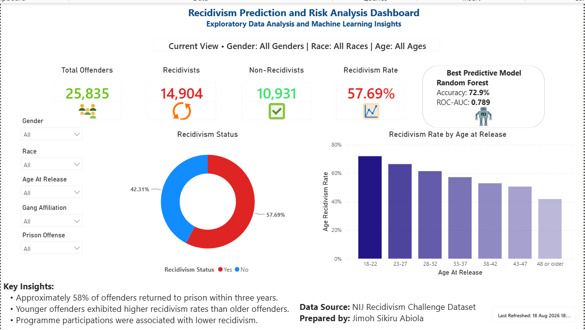
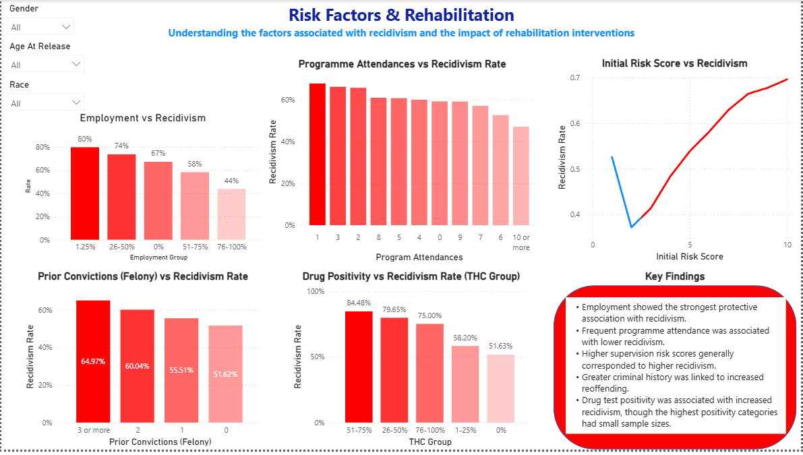
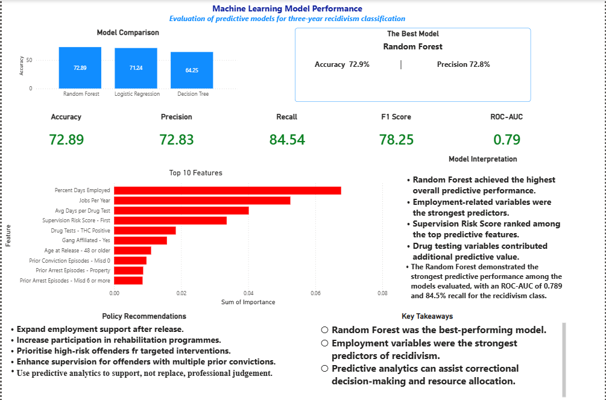
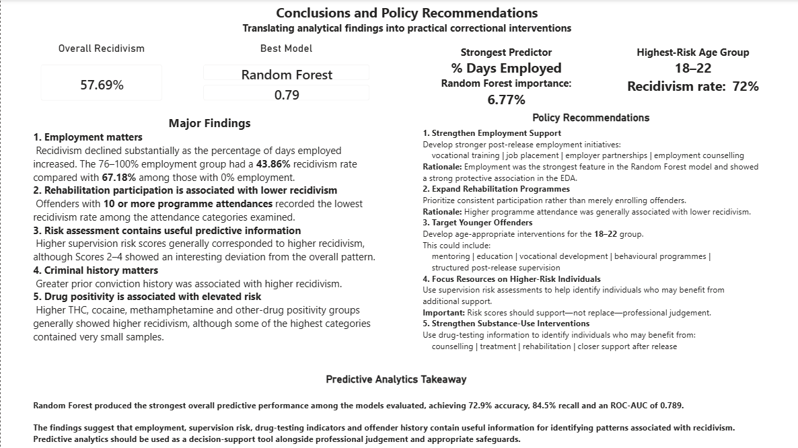

# Recidivism Prediction & Risk Analysis

### Exploratory Data Analysis, Machine Learning and Power BI Dashboard for Three-Year Recidivism


## Project Overview

Recidivism remains an important challenge for correctional systems because successful reintegration after release depends on a combination of social, behavioural, employment, supervision and criminal-history factors.

This project analyses correctional data to identify patterns associated with three-year recidivism and develops machine-learning models to predict whether an individual is likely to recidivate within three years.

The project combines:

- Exploratory Data Analysis (EDA)
- Data cleaning and preparation
- Descriptive analysis
- Machine-learning classification
- Model evaluation
- Feature-importance analysis
- Interactive Power BI visualisation
- Policy-oriented interpretation of analytical findings

The objective is not to replace professional correctional judgement, but to demonstrate how data analytics and predictive modelling can provide additional evidence for rehabilitation planning, resource allocation and decision support.

---

## Key Results

The dataset contains **25,835 records**.

### Overall Recidivism

| Outcome | Count | Proportion |
|---|---:|---:|
| Recidivated within 3 years | 14,904 | 57.69% |
| Did not recidivate within 3 years | 10,931 | 42.31% |
| **Total** | **25,835** | **100%** |

### Best-Performing Model

Among the three classification models evaluated, **Random Forest** achieved the strongest overall predictive performance.

| Metric | Random Forest |
|---|---:|
| Accuracy | **72.9%** |
| Precision | **72.8%** |
| Recall | **84.5%** |
| F1 Score | **78.2%** |
| ROC-AUC | **0.789** |

The model demonstrated particularly strong recall for the recidivism class, correctly identifying a substantial proportion of individuals who actually recidivated within three years.

---

# Dashboard Preview

The Power BI dashboard translates the analytical findings into an interactive visual story covering the overall recidivism profile, risk factors, predictive modelling results and policy recommendations.

## Page 1 — Executive Overview



The Executive Overview provides a high-level view of the dataset, overall recidivism rate, demographic patterns and the best-performing predictive model.

Key observations include:

- 25,835 individuals were analysed.
- 57.69% recidivated within three years.
- Younger release-age groups generally exhibited higher recidivism rates.
- Employment and programme participation emerged as important areas for further investigation.
- Random Forest was identified as the strongest predictive model.

---

## Page 2 — Risk Factors & Rehabilitation



This page examines factors associated with recidivism and highlights areas relevant to rehabilitation and reintegration.

Important patterns include:

- Higher employment levels were associated with lower recidivism.
- Greater programme participation was generally associated with lower recidivism.
- Higher supervision-risk scores generally corresponded with higher recidivism.
- Greater prior conviction history was associated with increased recidivism.
- Drug-test positivity showed associations with increased recidivism, although some high-positivity categories contained relatively small numbers of observations.

These findings represent **associations identified in the data and should not be interpreted as proof of causation**.

---

## Page 3 — Machine Learning Model Performance



Three classification models were evaluated:

1. Logistic Regression
2. Decision Tree
3. Random Forest

### Model Comparison

| Model | Accuracy | Precision | Recall | F1 Score | ROC-AUC |
|---|---:|---:|---:|---:|---:|
| **Random Forest** | **72.89%** | **72.83%** | **84.54%** | **78.25%** | **0.789** |
| Logistic Regression | 71.24% | 72.80% | 80.07% | 76.26% | 0.776 |
| Decision Tree | 64.25% | 69.00% | 69.07% | 69.04% | 0.634 |

Random Forest achieved the strongest overall performance across the principal evaluation metrics.

---

## Top Predictive Features

Feature-importance analysis from the Random Forest model identified the following variables among the strongest predictors:

1. Percent Days Employed
2. Jobs Per Year
3. Average Days per Drug Test
4. Initial Supervision Risk Score
5. THC Positivity
6. Gang Affiliation
7. Age at Release
8. Prior Conviction Episodes — Misdemeanor
9. Prior Arrest Episodes — Property
10. Prior Arrest Episodes — Misdemeanor

The prominence of employment-related variables is particularly noteworthy because employment was also strongly associated with recidivism during the exploratory analysis.

Feature importance should be interpreted as an indication of the variables that contributed to model predictions, **not as evidence that a variable independently causes recidivism**.

---

## Page 4 — Conclusions & Policy Recommendations



The final dashboard page translates the analytical findings into practical areas for consideration within correctional and rehabilitation programmes.

### Major Findings

#### 1. Employment matters

Recidivism declined substantially as the percentage of days employed increased.

The analysis found a recidivism rate of approximately:

- **67.18%** among individuals in the 0% employment group
- **43.86%** among individuals in the 76–100% employment group

Employment-related variables also ranked among the strongest predictors in the Random Forest model.

#### 2. Rehabilitation participation is associated with lower recidivism

Individuals with higher programme attendance generally showed lower recidivism rates.

The category with **10 or more programme attendances** recorded the lowest recidivism rate among the attendance categories examined.

#### 3. Risk assessment contains useful predictive information

Higher initial supervision-risk scores generally corresponded with higher recidivism.

However, the lower risk-score categories contained some deviations from the general pattern, demonstrating why individual risk assessment should not be reduced to a simple linear assumption.

#### 4. Criminal history matters

Greater prior conviction history was associated with higher recidivism.

This reinforces the importance of considering historical justice-system involvement when developing rehabilitation and supervision strategies.

#### 5. Drug-test indicators were associated with elevated recidivism

Higher drug-positivity groups generally showed higher recidivism rates.

However, some of the highest positivity categories contained relatively small numbers of observations. These results should therefore be interpreted cautiously.

---

# Policy Recommendations

Based on the analytical findings, the project proposes the following areas for consideration:

### 1. Strengthen Employment Support

Develop stronger post-release employment initiatives, including:

- Vocational training
- Job placement support
- Employer partnerships
- Employment counselling
- Structured employment-readiness programmes

### 2. Expand Rehabilitation Programmes

Prioritise meaningful and sustained participation in rehabilitation programmes rather than focusing only on enrolment.

### 3. Target Younger Offenders

The **18–22 age group** showed the highest observed recidivism rate in the analysis.

Age-appropriate interventions could include:

- Mentoring
- Education
- Vocational development
- Behavioural programmes
- Structured post-release supervision

### 4. Focus Resources on Higher-Risk Individuals

Supervision-risk information can help identify individuals who may benefit from additional support and monitoring.

Risk scores should support — **not replace — professional judgement**.

### 5. Strengthen Substance-Use Interventions

Drug-testing indicators can help identify individuals who may benefit from:

- Counselling
- Treatment
- Rehabilitation
- Substance-use education
- Additional post-release support

---

# Methodology

The project followed an end-to-end data analytics and machine-learning workflow.

```text
Raw Correctional Dataset
          │
          ▼
Data Cleaning & Validation
          │
          ▼
Exploratory Data Analysis
          │
          ├── Demographic Analysis
          ├── Employment Analysis
          ├── Programme Participation
          ├── Criminal History
          ├── Supervision Risk
          └── Drug-Test Indicators
          │
          ▼
Feature Preparation
          │
          ▼
Train/Test Split
          │
          ▼
Preprocessing
     ┌────┴────┐
     │         │
Numerical   Categorical
Imputation  Imputation
     │         │
     └────┬────┘
          ▼
One-Hot Encoding
          │
          ▼
Machine Learning
     ┌────┼────────────┐
     │    │            │
Logistic Decision    Random
Regression Tree      Forest
     │    │            │
     └────┼────────────┘
          ▼
Model Evaluation
          │
          ▼
Feature Importance
          │
          ▼
Power BI Dashboard
          │
          ▼
Findings & Policy Recommendations
```

---

# Data Preparation

The final modelling dataset contained:

- **25,835 observations**
- **45 modelling variables**
- A binary target variable representing three-year recidivism

The target variable was:

`Recidivism_Within_3years`

with:

- **Yes:** 14,904
- **No:** 10,931

Numerical variables were handled using median imputation, while categorical variables were handled using most-frequent imputation followed by one-hot encoding.

The dataset was divided into:

- **80% training data**
- **20% testing data**

Stratified sampling was used to preserve the target-class distribution between training and testing sets.

---

# Machine Learning

Three supervised classification algorithms were evaluated:

### Logistic Regression

Used as a strong interpretable baseline classification model.

### Decision Tree

Used to capture nonlinear relationships and provide a tree-based interpretation of classification decisions.

### Random Forest

Used as an ensemble learning method capable of modelling nonlinear relationships and interactions across multiple variables.

The final comparison showed that Random Forest provided the strongest overall predictive performance.

---

# Model Evaluation

The models were evaluated using:

### Accuracy

Measures the overall proportion of correct predictions.

### Precision

Measures the proportion of predicted recidivists who actually recidivated.

### Recall

Measures the proportion of actual recidivists correctly identified by the model.

### F1 Score

Provides a balance between precision and recall.

### ROC-AUC

Measures the model's ability to distinguish between the two outcome classes across classification thresholds.

For this project, recall is particularly important because failing to identify an individual who subsequently recidivates represents a different type of error from incorrectly flagging someone as higher risk.

---

# Tools & Technologies

### Programming & Analysis

- Python
- Pandas
- NumPy
- Matplotlib
- Seaborn
- Jupyter Notebook

### Machine Learning

- Scikit-learn
- Logistic Regression
- Decision Tree
- Random Forest
- One-Hot Encoding
- Imputation
- Classification metrics

### Business Intelligence

- Microsoft Power BI
- Interactive dashboards
- Slicers
- KPI cards
- Charts
- Analytical visualisation

### Version Control & Portfolio

- GitHub
- Jupyter Notebook
- Power BI

---

# Project Structure

```text
recidivism-prediction-correctional-data/
│
├── README.md
│
├── notebooks/
│   └── Recidivism_Analysis_and_Machine_Learning.ipynb
│
├── powerbi/
│   ├── Recidivism_Dashboard.pbix
│   └── README.md
│
└── images/
    ├── dashboard_page_1_executive_overview.png
    ├── dashboard_page_2_risk_factors.png
    ├── dashboard_page_3_model_performance.png
    └── dashboard_page_4_conclusions.png
```

---

# Reproducibility

The main analytical workflow is contained in the Jupyter Notebook:

`notebooks/Recidivism_Analysis_and_Machine_Learning.ipynb`

The notebook contains the major stages of the analysis, including:

- Data inspection
- Data cleaning
- Exploratory analysis
- Feature preparation
- Model development
- Model evaluation
- Feature-importance analysis

The Power BI report is available in:

`powerbi/Recidivism_Dashboard.pbix`

The notebook uses project-relative paths rather than machine-specific Windows paths to improve portability.

---

# Important Analytical & Ethical Considerations

Predictive analytics in correctional settings requires particular care.

The findings in this project should be understood as **analytical associations and predictive patterns**, not deterministic conclusions about individuals.

The model should not be used to:

- Automatically determine whether an individual should receive a particular sentence or sanction
- Replace professional assessment
- Treat predicted risk as certainty
- Justify discriminatory treatment
- Make decisions without considering relevant individual circumstances

Particular attention should be given to:

- Fairness
- Transparency
- Data quality
- Potential historical bias
- Appropriate human oversight
- Responsible interpretation of model predictions

Predictive analytics should therefore be used as a **decision-support tool alongside professional judgement**, appropriate safeguards and institutional policies.

---

# Key Takeaways

The project demonstrates that an end-to-end analytics workflow can transform a large correctional dataset into actionable analytical insights.

The main conclusions are:

1. **Employment-related variables were among the strongest predictors of recidivism.**
2. **Higher employment levels were associated with substantially lower observed recidivism.**
3. **Programme participation was generally associated with lower recidivism.**
4. **Supervision risk and criminal-history variables contained useful predictive information.**
5. **Drug-testing indicators contributed additional predictive information.**
6. **Random Forest achieved the strongest predictive performance among the models evaluated.**
7. **Predictive analytics can support correctional decision-making and resource allocation when used responsibly.**

---

# Portfolio Value

This project demonstrates an end-to-end data analytics workflow:

**Data → Cleaning → EDA → Feature Preparation → Machine Learning → Model Evaluation → Feature Importance → Power BI → Business/Policy Insight**

It demonstrates practical skills in:

- Data analysis
- Data cleaning
- Exploratory Data Analysis
- Python
- Pandas
- Scikit-learn
- Machine Learning
- Classification
- Model evaluation
- Feature importance
- Data visualisation
- Power BI
- Dashboard development
- Analytical storytelling
- Evidence-based recommendations

---

# Author

**Jimoh Sikiru Abiola**

Data Analyst | Business Intelligence | Information Science

This project represents an applied analytics portfolio project combining data analysis, machine learning, business intelligence and domain-informed interpretation.

---

## Disclaimer

This project is intended for **educational, analytical and portfolio purposes**.

The findings represent patterns observed in the analysed dataset and model predictions. They should not be interpreted as causal conclusions or as a substitute for professional correctional assessment, institutional policy or human judgement.
